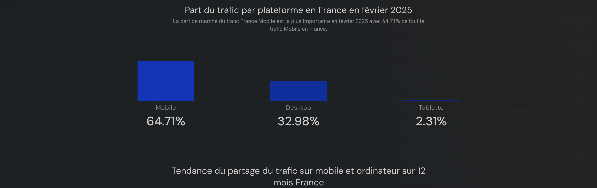
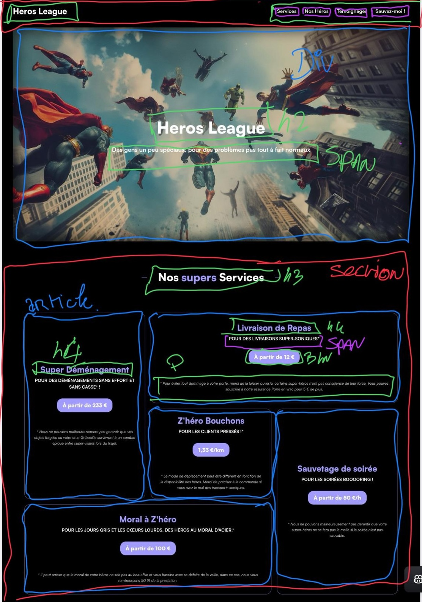

## 🦸 Hero League - Site Web Responsive

**Hero League** est un site web conçu en HTML et CSS, développé en Mobile-First pour assurer une navigation fluide sur tous les écrans (mobile, tablette, desktop).

### 🚀 Fonctionnalités

Design responsive avec Media Queries.

Présentation des héros, services et témoignages.

Navigation fluide et optimisée.

Bouton d’urgence pour contacter un héros.

#### <u>📱 Développement Mobile-First</u>

Le site a d'abord été conçu pour mobile, puis adapté aux écrans plus grands avec des Media Queries.

#### <u>📂 Structure du Projet</u>

index.html : Page principale

styles/ : Fichiers CSS organisés (reset.css , style.css)

assets/ : Images et polices

#### <u>⚙️ Technologies Utilisées</u>

1- HTML5 📄

2- CSS3 🎨 (Flexbox, Grid, animations)

📌 Améliorations Futures
Ajout de JavaScript pour plus d’interactivité

### 🌍 Démo en Ligne

🔗 [Heros League](https://thomasbrelot.github.io/Hero_League/)

### 🎯 Objectifs du Projet

✅ Appliquer la méthodologie **Mobile-First**  
✅ Utiliser **Flexbox & Grid** pour le responsive  
✅ Concevoir une **navigation intuitive et fluide**  
✅ Expérimenter avec **les animations CSS**

### 🏆 Challenges & Solutions

| **Problème**                                         | **Solution**                                                                                      |
| ---------------------------------------------------- | ------------------------------------------------------------------------------------------------- |
| **Commencement du site en Mobile-First**             | Décomposer la maquette fournie et réfléchir à la sémantique HTML ainsi qu'aux balises à utiliser. |
| **Ajuster les images en responsive sans distorsion** | Utilisation de `object-fit: cover;` et `max-width: 100%;`.                                        |
| **Optimisation des performances du CSS**             | Minification des fichiers CSS et chargement asynchrone des assets.                                |

  

### 📞 Contact

💌 Retrouve-moi sur [linkedin](https://www.linkedin.com/in/thomas-brelot/).

⭐ Stp, laisse une étoile si tu aimes le projet ! 🚀
